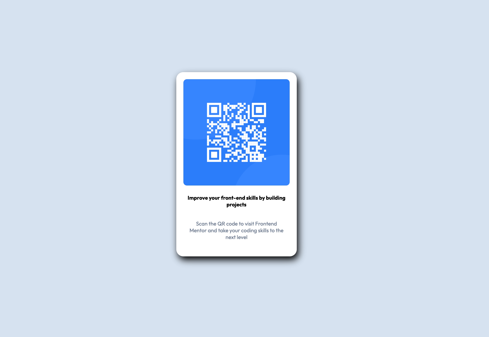

# Frontend Mentor - QR code component solution

This is a solution to the [QR code component challenge on Frontend Mentor](https://www.frontendmentor.io/challenges/qr-code-component-iux_sIO_H). Frontend Mentor challenges help you improve your coding skills by building realistic projects. 

## Table of contents

- [Overview](#overview)
  - [Screenshot](#screenshot)
- [My process](#my-process)
  - [Built with](#built-with)
  - [What I learned](#what-i-learned)
  - [Continued development](#continued-development)
  - [Useful resources](#useful-resources)
- [Acknowledgments](#acknowledgments)

## Overview
### Screenshot

## My process
### Built with
- Semantic HTML5 markup
- CSS custom properties
- Flexbox

### What I learned
I am fascinated with the concept of the Frontend Mentor site. It seems to be exactly what I needed to practice more of HTML and CSS - recreating designs that are also labelled by their respective difficulty. I believe this exercise gave me a much thorough understanding of Flexbox. Importing fonts from an external site was a new concept that I learned. In summary, this was a much needed practice to reinforce our learning. 

### Continued development
I see myself using Frontend Mentor more in the future.

### Useful resources
- MDN Border Reference Page - (https://developer.mozilla.org/en-US/docs/Web/CSS/Reference/Properties/border) - This was a must-have resource for this lab. I used it extensively to add borders, rounded corners, etc.

## Acknowledgments
Tishana Trainor and Paul Chapman - thank you!